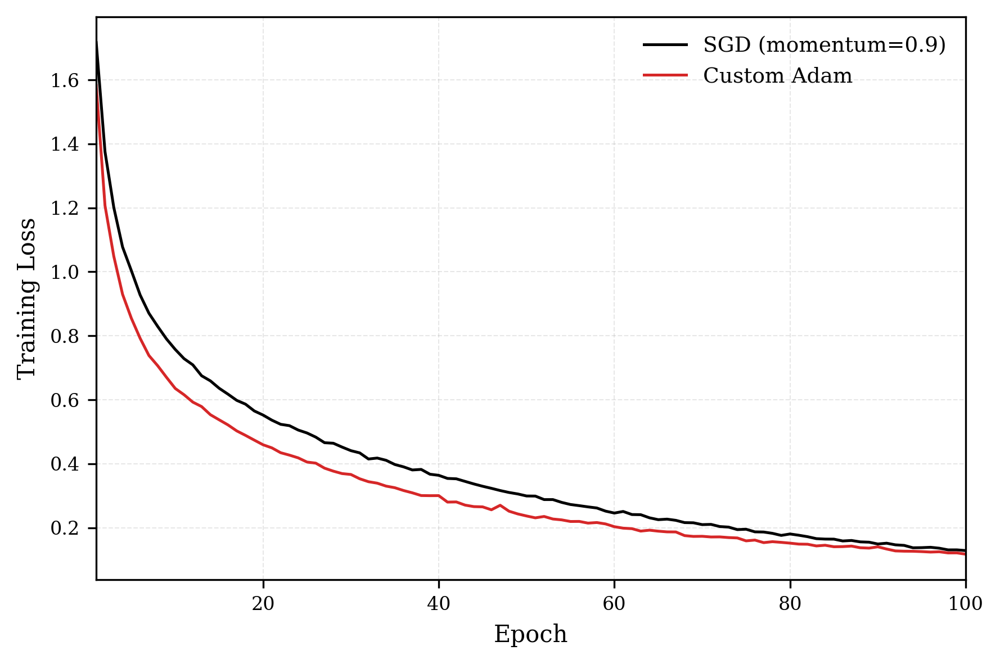

# ADAM 

Reimplementation of [Adam: A Method for Stochastic Optimization](https://arxiv.org/abs/1412.6980) (Kingma & Ba, 2014).

A first-order optimizer that maintains adaptive per parameter learning rates using running exponential averages of the first and second moments of the loss gradient.

## Algorithm

At each step, given parameters $\theta$ and loss gradient $g_t=\nabla_\theta\mathcal{L}$:

$$m_t=\beta_1 m_{t-1} + (1-\beta_1)g_t$$
$$v_t=\beta_2 v_{t-1}+(1-\beta_2)g_t^2$$

Bias corrected estimates:

$$\hat{m_t}=\frac{m_t}{1-\beta_1^t}$$
$$\hat{v_t}=\frac{v_t}{1-\beta_2^t}$$

Parameter updates:

$$\theta_t=\theta_{t-1}+\alpha\frac{\hat{m_t}}{\sqrt{\hat{v_t}}+\epsilon}$$

**Default Hyperparameters:** $\alpha=0.001$, $\beta_1=0.9$, $\beta_2=0.999$, $\epsilon=10^{-8}$

## Implementation Notes
- Bias correction is essential in early stages of training when $m_t$ and $v_t$ are initialized at zero - without it, the first few updates severely underestimate the loss gradient.
- $\epsilon$ is added to $\sqrt{\hat{v_t}}$, not $\hat{v_t}$ itself, as specified in the paper. 
- Implemented from scratch without `torch.optim`

## Results

**Experiment:** ResNet-18 trained on CIFAR-10 for 100 epochs. Custom Adam (lr=0.001) vs SGD with momentum (lr=0.01, momentum=0.9). Both optimizers started from identical random initial weights. Data augmentation included random horizontal flips, random crops, and color jitter.

**Observations:**
- Adam converges noticeably faster in the early phase of training (epochs 1–40), reaching a loss of ~0.3 while SGD is still around ~0.4. This is the key advantage of adaptive learning rates: Adam scales updates per-parameter using the second moment estimate, allowing it to make larger effective steps for infrequent/small gradients and smaller steps for frequent/large ones.
- SGD with momentum gradually closes the gap in later epochs (60–100), with both optimizers converging to roughly the same final loss (~0.1). This is consistent with the well-known observation that SGD with momentum can match or exceed Adam's final performance given enough training time, especially with well-tuned hyperparameters.
- Adam's curve is smoother throughout, while SGD shows slightly more variance in the loss trajectory. The momentum and second-moment averaging in Adam act as a natural smoothing mechanism on the gradient signal.
