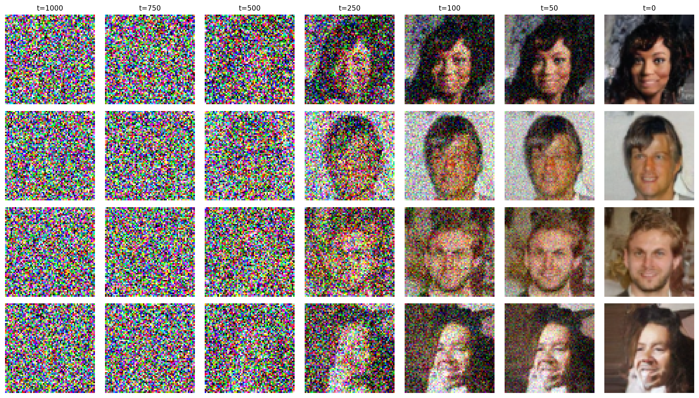

# DDPM

Reimplementation of [Denoising Diffusion Probabilistic Models](https://arxiv.org/abs/2006.11239) (Ho et al., 2020).

A generative model that learns to reverse a gradual noising process. Starting from pure Gaussian noise, the model iteratively denoises to produce samples that match the training distribution.

## Algorithm

### Forward Process (Adding Noise)

Given a data sample $x_0$, the forward process adds Gaussian noise over $T$ timesteps according to a variance schedule $\beta_1, ..., \beta_T$:

$$q(x_t | x_{t-1}) = \mathcal{N}(x_t; \sqrt{1-\beta_t}\, x_{t-1}, \beta_t I)$$

Using $\alpha_t = 1 - \beta_t$ and $\bar{\alpha}_t = \prod_{s=1}^{t} \alpha_s$, we can sample $x_t$ directly from $x_0$ in closed form:

$$q(x_t | x_0) = \mathcal{N}(x_t; \sqrt{\bar{\alpha}_t}\, x_0, (1 - \bar{\alpha}_t) I)$$

$$x_t = \sqrt{\bar{\alpha}_t}\, x_0 + \sqrt{1 - \bar{\alpha}_t}\, \epsilon, \quad \epsilon \sim \mathcal{N}(0, I)$$

### Reverse Process (Denoising)

A neural network $\epsilon_\theta$ is trained to predict the noise $\epsilon$ added at each timestep. The reverse process then iteratively denoises:

$$p_\theta(x_{t-1} | x_t) = \mathcal{N}(x_{t-1}; \mu_\theta(x_t, t), \sigma_t^2 I)$$

where the predicted mean is:

$$\mu_\theta(x_t, t) = \frac{1}{\sqrt{\alpha_t}} \left( x_t - \frac{\beta_t}{\sqrt{1 - \bar{\alpha}_t}} \epsilon_\theta(x_t, t) \right)$$

### Training Objective

The simplified loss is an MSE between the true noise and the predicted noise:

$$L = \mathbb{E}_{t, x_0, \epsilon} \left[ \| \epsilon - \epsilon_\theta(x_t, t) \|^2 \right]$$

**Default Hyperparameters:** $T=1000$, $\beta_1 = 10^{-4}$, $\beta_T = 0.02$ (linear schedule)

## Implementation Notes
- The noise schedule is linear from $\beta_1$ to $\beta_T$, as in the original paper. $\bar{\alpha}_t$ values are precomputed for efficient closed-form sampling of $x_t$.
- The model architecture is a U-Net with sinusoidal timestep embeddings, following the paper's specification.
- Sampling uses the full $T$-step reverse process (no accelerated sampling like DDIM).

## Dataset

CelebA is used for training. The torchvision auto-download is unreliable due to Google Drive rate limits.

1. Download the `.zip` file from [Kaggle](https://www.kaggle.com/datasets/jessicali9530/celeba-dataset)
2. Move it into `data/celeba_raw/` at the repo root, creating the folder if it doesn't exist
3. Extract and clean up:
```bash
unzip archive.zip
rm archive.zip
```

The training script expects images at `data/celeba_raw/img_align_celeba/img_align_celeba/*.jpg`.

## Results

**Experiment:** U-Net trained on CelebA (64x64, center-cropped) for 50 epochs with Adam (lr=2e-4), linear noise schedule ($\beta_1=10^{-4}$, $\beta_T=0.02$, $T=1000$).



**Observations:**
- The reverse diffusion process shows a clear progression from pure Gaussian noise (t=1000) to recognizable face structures. Coarse features like face shape and hair emerge early (around t=500–250), while fine details like eyes, skin texture, and lighting are refined in the final steps (t=100–0).
- The model produces diverse samples with varied poses, hair styles, and lighting conditions, indicating it has learned the underlying distribution rather than memorizing training examples.
- Some artifacts remain visible at 64x64 resolution, particularly around hair boundaries and backgrounds — this is expected for a simple U-Net without attention layers or EMA averaging.