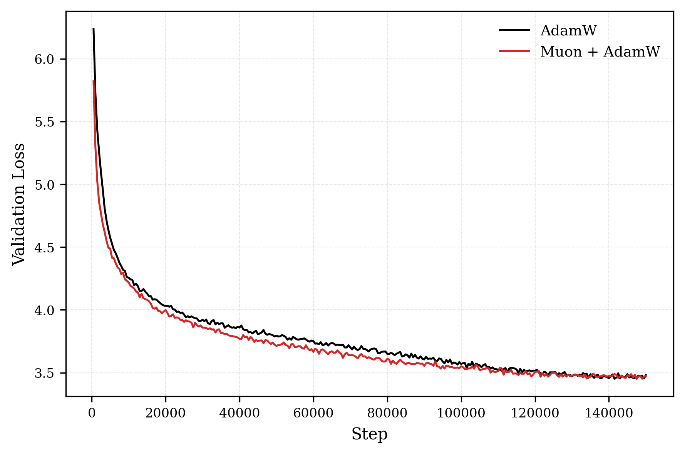

# Muon

Reimplementation of the Muon optimizer from Keller Jordan's blog post [Muon: An optimizer for hidden layers](https://kellerjordan.github.io/posts/muon/).

Muon (Momentum + Orthogonalization) is an optimizer designed specifically for hidden layer weight matrices. It applies Newton's method to the update step by orthogonalizing the momentum buffer, effectively steering weight matrices toward orthogonality during training.

## Algorithm

At each step, given a weight matrix $W$ and loss gradient $G_t = \nabla_W \mathcal{L}$:

Momentum update:

$$M_t = \beta M_{t-1} + (1 - \beta) G_t$$

Orthogonalize via Newton-Schulz iteration (approximating the matrix polar decomposition $U\Sigma V^T \to UV^T$):

$$\hat{M}_t = \text{NewtonSchulz}(M_t)$$

Parameter update:

$$W_t = W_{t-1} - \alpha \hat{M}_t$$

The Newton-Schulz iteration approximates the polar factor by repeatedly applying:

$$X_{k+1} = a X_k + b (X_k X_k^T) X_k + c (X_k X_k^T)^2 X_k$$

with fixed coefficients $(a, b, c) = (3.4445, -4.7750, 2.0315)$ for 5 iterations, which is sufficient to converge for spectral norms below 1.01.

## Implementation Notes
- Muon is intended only for hidden layer weight matrices (2D+ parameters). Embeddings, classifier heads, and 1D parameters (biases, norms) should use a standard optimizer like Adam.
- The Newton-Schulz iteration replaces the SVD-based polar decomposition for efficiency — it avoids the $O(n^3)$ cost of SVD and is more GPU-friendly.
- Non-square weight matrices are handled by transposing so the tall dimension comes first before orthogonalization.

## Results

Trained a GPT-2 small (85M params, d_model=768, 12 layers, 12 heads) on a FineWeb-Edu subset (~1B tokens) for 150k steps with batch size 32 and seq_len 256.

**Muon + AdamW** uses Muon (lr=0.02) for hidden weight matrices (84.9M params) and AdamW (lr=3e-4) for embeddings/layernorms. **AdamW** baseline uses AdamW (lr=3e-4) for all parameters. Both use linear warmup (200 steps) + cosine decay.

### Validation Loss

### Convergence Speed

Muon reaches the same validation loss as AdamW significantly earlier in training:

| Muon Loss | Muon Step | AdamW Step | Steps Saved |
|-----------|-----------|------------|-------------|
| 4.487     | 5,000     | 6,000      | 1,000       |
| 4.219     | 10,000    | 11,500     | 1,500       |
| 4.081     | 15,000    | 18,000     | 3,000       |
| 3.859     | 30,000    | 36,000     | 6,000       |
| 3.713     | 50,000    | 68,500     | 18,500      |

The advantage grows over training — at step 50k, Muon is 18,500 steps (37%) ahead.

### Final Performance (150k steps)

| Optimizer    | Val Loss | Perplexity |
|-------------|----------|------------|
| AdamW       | 3.480    | 32.5       |
| Muon + AdamW| 3.475    | 32.3       |

Final performance converges to roughly the same point, but Muon gets there faster. The gap is most pronounced in the 10k–80k step range where Muon maintains a consistent lead in loss.
